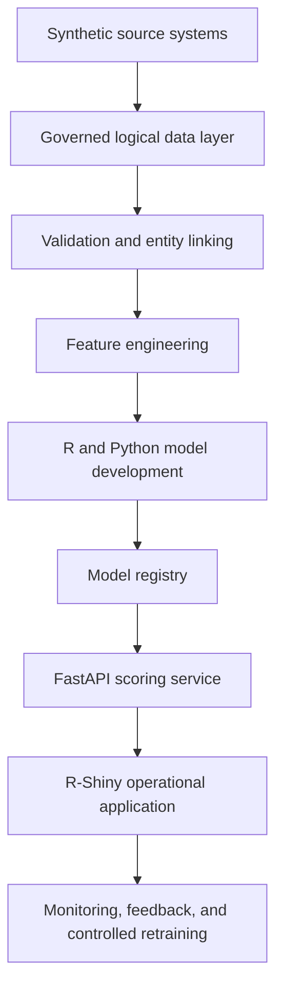

# Architecture

## Target Flow

```text
Synthetic Source Systems
        |
Governed Logical Data Layer
        |
Validation and Entity Linking
        |
Feature Engineering
        |
R and Python Model Development
        |
Model Registry
        |
FastAPI Scoring Service
        |
R-Shiny Operational Application
        |
Monitoring, Feedback and Controlled Retraining
```



## Current Milestone 1 State

Milestone 1 implements only repository foundation, documentation, configuration placeholders, a minimal Python package, validation scripts, tests, and CI workflow definitions. No data, database views, features, models, APIs, applications, monitoring, retraining, or deployments are implemented.

## Planned Local Implementation

The local implementation will use synthetic source files or local databases, SQL or SQL-compatible governed views, Python validation and modelling, a local model registry, FastAPI serving, and R-Shiny for operational workflows.

## Optional Denodo Integration

The future `real_denodo` path may connect to Denodo for governed virtual views. The local fallback will be labelled `denodo_compatible_local`.

## Optional SAS Viya Integration

Milestone 15.1 introduces an explicit provider-neutral model-lifecycle boundary:

```text
PostgreSQL
-> Denodo
-> feature engineering
-> Python model training/evaluation
-> lifecycle provider
   -> local registry
   -> SAS Viya
-> approval/promotion
-> API and R Shiny
-> monitoring and retraining
```

The default lifecycle provider is `local_model_lifecycle`, which delegates to the existing local registry and governance workflow. The `real_sas_viya` provider is optional and remains disabled unless explicitly configured with local environment secrets.

## Target Environments

Development is local only in Milestone 1. Staging and production are documented target states that require later infrastructure, approval, and evidence.
