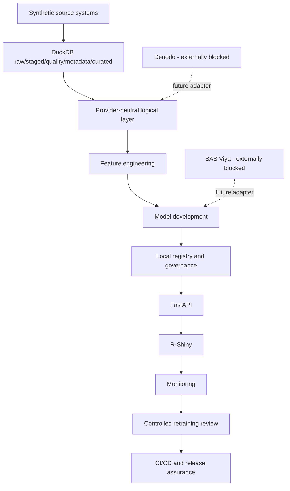

# End To End Governance Flow

```mermaid
flowchart TD
  Synthetic[Synthetic source systems] --> DuckDB[DuckDB raw/staged/quality/metadata/curated]
  DuckDB --> Logical[Provider-neutral logical layer]
  Logical --> Features[Feature engineering]
  Features --> Model[Model development]
  Model --> Registry[Local registry and governance]
  Registry --> API[FastAPI]
  API --> Shiny[R-Shiny]
  Shiny --> Monitoring[Monitoring]
  Monitoring --> Retraining[Controlled retraining review]
  Retraining --> Delivery[CI/CD and release assurance]
  Denodo[Denodo - externally blocked] -. future adapter .-> Logical
  Viya[SAS Viya - externally blocked] -. future adapter .-> Model
```
