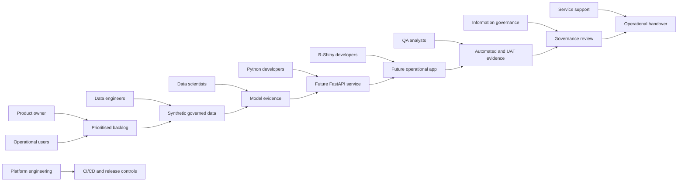

# Working Together Delivery Model

This project is designed as a collaborative analytical-product delivery model, not a single-person model exercise.

## Responsibilities

Operational users provide workflow context, UAT feedback, and decision-support boundaries. The product owner maintains scope, milestone acceptance, and release approval. Data engineers own synthetic source design, contracts, lineage, and governed views. Data scientists own modelling evidence, thresholds, monitoring interpretation, and retraining proposals. R-Shiny developers own user workflows and modular application quality. Python developers own package, service, validation, and model-lifecycle code. QA colleagues own regression checks, test plans, and UAT traceability. Information governance reviews data boundaries, audit evidence, and promotion controls. Platform engineering owns CI/CD, runtime, secrets, and rollback controls. Service support owns runbooks, incident triage, and handover readiness.

## Handoffs and Feedback Loops

Backlog items move from product definition to technical design, implementation, review, UAT, governance review, and support handover. Pull requests must identify the milestone, tests, documentation impact, generated artefacts, and security review. Monitoring and feedback will later feed controlled retraining, but promotion requires human approval.

## Release Approval

Milestone releases require passing validation, user acceptance where applicable, governance assessment, and handover documentation. Milestone 1 implements only the collaboration foundations and templates.
